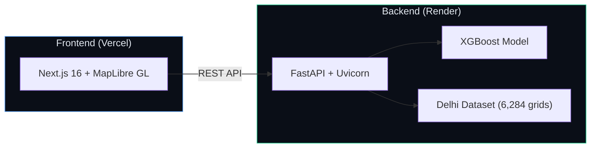

<p align="center">
  
  
  
  
  
  
  
  
</p>

# 🏙️ Urban Shadow — Delhi Urban Usability Intelligence

> **Grid-level urban sustainability intelligence for NCT Delhi** — 6,284 spatial cells × 36 indicators × XGBoost ML scoring, with interactive MapLibre visualization, what-if simulation, and AI-driven intervention recommendations.

---

## 🚀 Live Demo

| Service | URL |
|---------|-----|
| **🌐 Frontend** (Vercel) | [https://urban-shadow-test.vercel.app](https://urban-shadow-test.vercel.app) |
| **⚡ API** (Render) | [https://urban-shadow-api.onrender.com](https://urban-shadow-api.onrender.com) |
| **📖 API Docs** (Swagger) | [https://urban-shadow-api.onrender.com/docs](https://urban-shadow-api.onrender.com/docs) |

> [!NOTE]
> The Render backend runs on the free tier and may take **30–60 seconds** to wake up from a cold start on first access. The frontend includes automatic retry logic to handle this gracefully.

---

## 🏗️ Architecture



---

## ✨ Features

### 📊 Intelligence Map
- **6,284 grid cells** rendered as interactive polygon overlays on a MapLibre GL map centered on NCT Delhi.
- **Multiple data layers** — switch between UUS Score, population density, PM2.5, NDVI, elevation, and 30+ other indicators.
- **Heatmap mode** — toggle a continuous density heatmap for spatial hotspot analysis.
- Click any grid cell to open its **sustainability dossier** with full indicator breakdown.

### 🎯 UUS Scoring Engine
- **36 urban indicators** across heat, vegetation, weather, terrain, air quality, population, roads, traffic, walkability, buildings, green space, drainage, public transport, essential services, and commercial activity.
- **XGBoost regression model** trained on the Delhi dataset, producing a normalized Urban Usability Score (UUS) from 0 to 100.
- **5-tier classification**: Critical → Low → Moderate → Good → Excellent.

### 🔬 What-If Simulation
- Adjust any of the 36 model features via sliders and **re-run the XGBoost model server-side** in real-time.
- See the predicted UUS delta instantly — no client-side estimation.

### 🤖 AI Intervention Suggestions
- Data-driven, deterministic recommendations based on actual indicator thresholds.
- Actionable suggestions for improving grid-level urban sustainability.

### 📈 Analytics & Rankings
- **Score distribution histograms** and **classification pie charts** from Recharts.
- **Feature importance** visualization showing which indicators drive the model most.
- **Top/Bottom rankings** with sortable tables and direct map navigation.

### 🔄 Grid Comparison
- Compare up to 3 grids side-by-side with full indicator breakdowns and score visualization.

---

## 📂 Project Structure

```
urban_shadow/
├── backend/                    # FastAPI backend
│   ├── main.py                 # App entry point, routes, CORS, service init
│   ├── requirements.txt        # Python dependencies
│   ├── data/
│   │   ├── delhi_final_dataset.csv      # 6,284 grid records × 46 columns
│   │   ├── delhi_grid_500m.geojson      # Grid cell polygon geometries
│   │   └── grid_area_names.csv          # Grid ID → locality name mapping
│   ├── model/
│   │   ├── uus_model.pkl                # Trained XGBoost model
│   │   └── feature_columns.json         # 36 model input features
│   ├── services/
│   │   ├── grid_service.py              # Grid data loading, UUS computation
│   │   ├── model_service.py             # XGBoost inference, feature importance
│   │   ├── analytics_service.py         # Aggregate statistics
│   │   ├── simulation_engine.py         # What-if simulation
│   │   └── recommendation_service.py    # AI suggestions engine
│   └── schemas/
│       └── api_models.py                # Pydantic request/response models
├── frontend/                   # Next.js 16 frontend
│   ├── app/                    # App Router pages
│   ├── components/
│   │   ├── map/                # MapLibre GL map components
│   │   │   ├── delhi-map.tsx            # Main map orchestrator
│   │   │   ├── map-controls.tsx         # Zoom, fullscreen, layer switcher
│   │   │   ├── map-header-overlay.tsx   # Layer name + grid count badge
│   │   │   ├── map-hover-tooltip.tsx    # Grid hover tooltip
│   │   │   ├── map-legend.tsx           # Continuous color legend
│   │   │   └── geography.ts            # Basemap tiles, Delhi viewport
│   │   ├── panel/              # Grid detail panel components
│   │   │   ├── grid-detail-panel.tsx    # Dossier layout
│   │   │   ├── score-ring.tsx           # Animated score ring
│   │   │   ├── indicator-list.tsx       # Indicator table
│   │   │   ├── grid-profile-pie.tsx     # Indicator profile radar
│   │   │   ├── explanation-section.tsx  # Feature importance explainer
│   │   │   ├── ai-suggestions.tsx       # AI intervention cards
│   │   │   ├── what-if-dialog.tsx       # Simulation modal
│   │   │   └── what-if-slider-item.tsx  # Individual slider card
│   │   ├── views/              # Page-level view components
│   │   │   ├── intelligence-view.tsx    # Map + dossier layout
│   │   │   ├── overview-view.tsx        # KPI dashboard
│   │   │   ├── analytics-view.tsx       # Charts orchestrator
│   │   │   ├── analytics-distribution-card.tsx
│   │   │   ├── analytics-classification-card.tsx
│   │   │   ├── analytics-feature-card.tsx
│   │   │   ├── rankings-view.tsx        # Sortable grid rankings
│   │   │   ├── compare-view.tsx         # Grid comparison orchestrator
│   │   │   ├── compare-grid-card.tsx    # Comparison card organism
│   │   │   └── compare-search.tsx       # Grid search autocomplete
│   │   ├── shell/              # App shell (sidebar, topbar)
│   │   └── ui/                 # Reusable UI primitives
│   └── lib/
│       ├── api.ts              # API client with cold-start retry
│       ├── app-state.ts        # Global state (Zustand)
│       ├── hooks.ts            # SWR data hooks
│       ├── types.ts            # TypeScript interfaces
│       ├── uus.ts              # Score → color band helpers
│       └── utils.ts            # Utility functions
├── render.yaml                 # Render deployment blueprint
├── run_local.ps1               # One-command local dev launcher
└── README.md
```

---

## 🔌 API Reference

| Endpoint | Method | Description |
|----------|--------|-------------|
| `/` | `GET` | Platform info, version, docs link |
| `/api/health` | `GET` | Health check — model + dataset status |
| `/health` | `GET` | Health check alias |
| `/api/overview` | `GET` | Aggregate stats (avg/min/max UUS, class counts) |
| `/api/grids` | `GET` | Paginated grid list (`?limit=100&offset=0`) |
| `/api/grids/geojson` | `GET` | All grids as GeoJSON FeatureCollection (Points) |
| `/api/grids/cells` | `GET` | Grid cell polygons as GeoJSON (500m squares) |
| `/api/grids/{grid_id}` | `GET` | Full record for one grid (all 46 columns + UUS) |
| `/api/grids/{grid_id}/explanation` | `GET` | Global feature importances for a grid |
| `/api/rankings` | `GET` | Top-N + Bottom-N grids by UUS (`?limit=10`) |
| `/api/analytics` | `GET` | Distribution, classification, feature importance |
| `/api/ai-suggestions` | `POST` | Data-driven improvement suggestions |
| `/api/simulate` | `POST` | What-if simulation with modified features |

---

## 🛠️ Local Development

### Prerequisites
- **Python 3.11+** with pip
- **Node.js 20+** with npm

### Quick Start (PowerShell)

```powershell
# One-command launch — installs venv, starts backend + frontend
powershell -ExecutionPolicy Bypass -File .\run_local.ps1
```

### Manual Setup

**Backend:**
```bash
cd backend
python -m venv ../.venv
../.venv/Scripts/activate      # Windows
pip install -r requirements.txt
uvicorn main:app --host 127.0.0.1 --port 8000 --reload
```

**Frontend:**
```bash
cd frontend
npm install
# Set backend URL for local development
echo "NEXT_PUBLIC_API_URL=http://localhost:8000" > .env.local
npm run dev
```

Open [http://localhost:3000](http://localhost:3000) — the app will connect to the local backend.

---

## 🚢 Deployment

### Backend (Render)
The backend is deployed as a **Python Web Service** on Render using `render.yaml`:
- **Build**: `pip install -r requirements.txt`
- **Start**: `uvicorn main:app --host 0.0.0.0 --port $PORT`
- **Health Check**: `/api/health`

### Frontend (Vercel)
The frontend is deployed on **Vercel** with:
- **Framework**: Next.js (auto-detected)
- **Root Directory**: `frontend/`
- **Environment Variable**: `NEXT_PUBLIC_API_URL=https://urban-shadow-api.onrender.com`

---

## 📊 Scoring Model

The UUS (Urban Usability Score) is computed by an **XGBoost Regressor** trained on 36 urban indicators:

```
urban_usability_score = XGBoost(
  heat, vegetation, weather, terrain, air_quality,
  population, nightlight, water, roads, traffic,
  vehicles, walkability, buildings, green_space,
  drainage, public_transport, essential_services,
  commercial_activity
)

Classification tiers (equal quintiles over observed range):
  Critical (<20%)  |  Low (20-40%)  |  Moderate (40-60%)
  Good (60-80%)    |  Excellent (>80%)
```

Raw model predictions are linearly normalized to a **16–83 display range** matching the observed dataset spread.

---

## 📄 License

This project was built for academic and research purposes. See the repository for license details.
